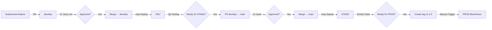

# CI/CD Pipeline - SecretMagic Microservice

**Статус документа:** 🚧 В разработке
**Последнее обновление:** 2025-11-23
**Версия:** 1.0 (адаптировано из Integrator)

---

## 📋 ОБЗОР

Этот документ описывает процесс Continuous Integration и Continuous Deployment (CI/CD) для микросервиса `secretmagic` в рамках AutoOrder Platform.

**Цели:**
- Автоматизация тестирования и деплоя через окружения DEV → STAGE → PROD
- Минимизация ручных операций и человеческих ошибок
- Быстрая обратная связь для разработчиков (CI на каждый PR)
- Безопасный деплой в production с Blue/Green strategy
- Готовность к миграции с Docker Swarm на Kubernetes

---

## 🌳 GIT FLOW (облегчённая модель)

### Ветки

| Ветка | Назначение | Защита | Деплой |
|-------|-----------|--------|--------|
| `main` | Стабильная production-ready ветка | ✅ Protected (только PR) | STAGE (auto) |
| `develop` | Активная разработка | ✅ Protected (только PR) | DEV (auto) |
| `feature/*` | Разработка новых фич | ❌ | - |
| `fix/*` | Исправление багов | ❌ | - |
| `hotfix/*` | Срочные исправления для prod | ❌ | - |

### Особенности облегчённой модели

- **Нет отдельной ветки `stage`** - используем `main` как базу для STAGE и PROD
- **Нет веток `release/*`** - релизы создаются через теги на `main`
- **Hotfix** мержится сразу в `main` и `develop` (cherry-pick или merge)

### Workflow разработки



---

## 🎯 ОКРУЖЕНИЯ И МАППИНГ

### Таблица соответствия

| Окружение | Git | Деплой | Образ | Автоматизация |
|-----------|-----|--------|-------|---------------|
| **DEV** | `develop` | secretmagic-dev | `secretmagic:dev-abc123f` | ✅ Auto (push в develop) |
| **STAGE** | `main` | secretmagic-stage | `secretmagic:stage-abc123f` | ✅ Auto (push в main) |
| **PROD** | tag `vX.Y.Z` | secretmagic-prod | `secretmagic:v1.2.3` | 🔐 Manual (workflow_dispatch) |

### Инфраструктура (TODO: уточнить)

**Вопросы:**
- [ ] Хосты Swarm: одна ВМ для всех окружений или отдельные?
- [ ] IP адреса / DNS имена для DEV/STAGE/PROD Swarm managers
- [ ] SSH доступ: пользователь, ключи для GitHub Actions
- [ ] Разделение сетей: отдельные overlay сети для каждого окружения?

**Текущая конфигурация (из кода):**
- DEV: `secretmagic-dev_*` stack, сеть `autoorder-net-dev`
- STAGE: `secretmagic-stage_*` stack, сеть `autoorder-net-stage` (TODO: создать)
- PROD: `secretmagic-prod_*` stack, сеть `autoorder-net-prod`

---

## 🐳 DOCKER REGISTRY И ВЕРСИОНИРОВАНИЕ

### Registry

**Провайдер:** Selectel Container Registry

**Преимущества для проекта:**
- ✅ Минимальная латентность (registry в том же DC что и Swarm)
- ✅ Нет rate limits (в отличие от Docker Hub free tier)
- ✅ Нет внешней зависимости от интернета для production
- ✅ Единая зона ответственности и биллинг с облаком Selectel
- ✅ Можно ограничить egress-трафик для безопасности

**Базовый URL:**
```
cr.selcloud.ru/autoorder-platform/secretmagic
```

**Авторизация:**
```bash
docker login cr.selcloud.ru
# Username: token
# Password: <хранится в GitHub Secrets: SELECTEL_REGISTRY_PASSWORD>
```

**Статус:**
- ✅ Реестр `autoorder-platform` создан
- ✅ Токен для авторизации получен (добавить в GitHub Secrets)

**Вопросы:**
- [ ] Политика retention: сколько хранить старые образы? (рекомендация: 30 дней для dev/stage, все для prod)

### Схема версионирования образов

| Окружение | Схема тега | Пример | Описание |
|-----------|-----------|--------|----------|
| **DEV** | `dev-${SHORT_SHA}` | `dev-abc123f` | 7 символов SHA коммита |
| **STAGE** | `stage-${SHORT_SHA}` | `stage-def456a` | 7 символов SHA коммита |
| **PROD** | `v${SEMVER}` | `v1.2.3` | Semantic versioning |
| **PROD** | `prod-${SHORT_SHA}` | `prod-abc123f` | Дополнительно для rollback |

**Примеры:**
```bash
# DEV (автоматически на push в develop)
cr.selcloud.ru/autoorder-platform/secretmagic:dev-abc123f

# STAGE (автоматически на push в main)
cr.selcloud.ru/autoorder-platform/secretmagic:stage-def456a

# PROD (вручную на tag v1.2.3)
cr.selcloud.ru/autoorder-platform/secretmagic:v1.2.3
cr.selcloud.ru/autoorder-platform/secretmagic:prod-abc123f
```

---

## ⚡ GITHUB ACTIONS RUNNERS

### Лимиты для приватных репозиториев

| План | Минуты/месяц | Множитель (Linux/Windows/macOS) |
|------|--------------|----------------------------------|
| GitHub Free | 2,000 | 1x / 2x / 10x |
| GitHub Pro | 3,000 | 1x / 2x / 10x |
| GitHub Team | 3,000 | 1x / 2x / 10x |

**Решение:** Self-hosted runner для CD (build + deploy), GitHub-hosted для CI (lint + tests).

---

### Self-hosted runner: установка

**Требования:**
- Ubuntu 22.04+ VM (2 vCPU, 4 GB RAM)
- Docker установлен
- Доступ к Swarm manager и Selectel Registry

**Инструкция:**

```bash
# 1. На VM создать runner
mkdir actions-runner && cd actions-runner
curl -o actions-runner-linux-x64-2.311.0.tar.gz -L \
  https://github.com/actions/runner/releases/download/v2.311.0/actions-runner-linux-x64-2.311.0.tar.gz
tar xzf ./actions-runner-linux-x64-2.311.0.tar.gz

# 2. Конфигурация (токен из GitHub: Settings → Actions → Runners → New)
./config.sh --url https://github.com/vmazurovskiy/autoorder-integrator --token <TOKEN>
# Labels: self-hosted,autoorder-ci
# Name: autoorder-runner-01

# 3. Установить как systemd service
sudo ./svc.sh install
sudo ./svc.sh start

# 4. Добавить в группу docker
sudo usermod -aG docker <runner-user>
sudo ./svc.sh restart
```

**Использование в workflows:**
```yaml
jobs:
  build-deploy:
    runs-on: [self-hosted, autoorder-ci]  # Self-hosted

  lint-test:
    runs-on: ubuntu-latest  # GitHub-hosted
```

---

### Оптимизация workflows

**1. Игнорировать docs:**
```yaml
on:
  push:
    paths-ignore: ['docs/**', '*.md']
```

**2. Кэш Python-пакетов:**
```yaml
- uses: actions/cache@v3
  with:
    path: ~/.cache/pip
    key: ${{ runner.os }}-pip-${{ hashFiles('**/requirements.txt') }}
```

**3. Отмена устаревших runs:**
```yaml
concurrency:
  group: ${{ github.workflow }}-${{ github.ref }}
  cancel-in-progress: true
```

---

### Статус

- [x] Создать VM для runner (10.77.0.3 - `autoorder-platform-cicd-runner-01`)
- [x] Установить runner с label `autoorder-ci` (v2.329.0)
- [x] Проверить доступ к Swarm и Registry
- [x] Настроить systemd service (auto-start enabled)
- [x] Создать deployment пользователя `autoorder-cicd-runner` на Swarm manager
- [x] Настроить SSH-доступ (runner → Swarm manager)
- [x] **КРИТИЧНО:** Настроить registry credentials для deployment пользователя

---

### SSH-based Deployment Setup

**Архитектура:**
```
GitHub Actions (runner VM 10.77.0.3)
  └─→ SSH → autoorder-cicd-runner@10.77.0.1 (Swarm manager)
      └─→ docker service update
```

**Шаг 1: Создать deployment пользователя на Swarm manager**
```bash
# На Swarm manager (10.77.0.1)
sudo useradd -m -s /bin/bash autoorder-cicd-runner
sudo usermod -aG docker autoorder-cicd-runner
```

**Шаг 2: Настроить SSH ключ**
```bash
# На runner VM (10.77.0.3) от имени github-runner
ssh-keygen -t ed25519 -f ~/.ssh/id_ed25519 -N '' -C 'github-runner@autoorder-cicd'

# Скопировать публичный ключ на Swarm manager
ssh-copy-id autoorder-cicd-runner@10.77.0.1
# Или вручную добавить в ~/.ssh/authorized_keys
```

**Шаг 3: ⚠️ КРИТИЧНО - Настроить registry credentials**

**ВАЖНО:** Пользователь `autoorder-cicd-runner` должен иметь credentials для Selectel Registry, чтобы `--with-registry-auth` работал при `docker service update`.

```bash
# На Swarm manager (10.77.0.1)
sudo -u autoorder-cicd-runner bash -c 'echo "$SELECTEL_REGISTRY_PASSWORD" | docker login cr.selcloud.ru/autoorder-platform -u token --password-stdin'
```

**Проверка:**
```bash
# Проверить что credentials сохранены
sudo -u autoorder-cicd-runner cat /home/autoorder-cicd-runner/.docker/config.json | jq '.auths | keys'
# Должно вернуть: ["cr.selcloud.ru"]
```

**Почему это критично:**
- Workflow использует `docker service update --with-registry-auth`
- `--with-registry-auth` передаёт credentials только если они есть у текущего пользователя
- Без credentials Swarm не сможет pull'ить образ из private registry → `No such image` error

---

## 🧪 CONTINUOUS INTEGRATION (CI)

### Триггеры

CI запускается на каждый Pull Request в ветки `develop` и `main`.

### Этапы CI

1. **Checkout** - клонирование репозитория
2. **Setup Python** - установка Python 3.12+
3. **Cache** - кэширование pip пакетов для ускорения
4. **Lint** - проверка кода (ruff, mypy)
5. **Unit Tests** - запуск unit тестов (pytest)
6. **Integration Tests** - запуск integration тестов (pytest с fixtures)
7. **Coverage Check** - проверка покрытия кода (≥75%)
8. **Type Check** - проверка типов (mypy)

### Инструменты

- **Linter**: `ruff` (fast Python linter)
- **Type Checker**: `mypy` (статическая типизация)
- **Tests**: `pytest` с покрытием (pytest-cov)
- **Integration Tests**: pytest с fixtures (StarRocks, PostgreSQL mock)
- **Coverage**: `pytest-cov` с проверкой порога 75%

### Makefile таргеты

```makefile
lint:           # Запуск линтера (ruff check)
test:           # Unit тесты с покрытием
test-coverage:  # Тесты с HTML отчётом
typecheck:      # Проверка типов (mypy)
fmt:            # Форматирование кода (ruff format)
isort:          # Сортировка импортов (ruff)
check:          # Полная проверка (fmt + lint + typecheck + test)
docker-build:   # Сборка Docker образа
docker-push:    # Push образа в registry
```

**Файлы:**
- 🚧 `Makefile` - TODO: создать
- 🚧 `pyproject.toml` - TODO: создать (конфигурация ruff, mypy)
- 🚧 `.github/workflows/ci.yml` - TODO: создать

---

## 🚀 CONTINUOUS DEPLOYMENT (CD)

### DEV - Автоматический деплой ✅

**Триггер:** Push в ветку `develop`

**Workflow:**
1. Build Docker образа с тегом `dev-${SHORT_SHA}` (используя BuildKit cache)
2. Push образа в Selectel Container Registry
3. SSH подключение к DEV Swarm manager (autoorder-cicd-runner@10.77.0.1)
4. Выполнение `docker service update --image <IMAGE> --with-registry-auth secretmagic-dev_secretmagic`
5. Проверка статуса deployment

**Файл:** ✅ `.github/workflows/cd-dev.yml` - создан и работает

**Секреты (GitHub Secrets):**
- ✅ `SELECTEL_REGISTRY_PASSWORD` - настроен
- ℹ️ SSH доступ: через ключ github-runner пользователя на runner VM (не через GitHub Secret)

**Текущая конфигурация:**
- Runner: `10.77.0.3` (autoorder-runner-01, self-hosted)
- Swarm manager: `10.77.0.1` (hostname: lde)
- Deployment user: `autoorder-cicd-runner`
- Registry: `cr.selcloud.ru/autoorder-platform/secretmagic:dev-*`
- Stack: `secretmagic-dev` (сервис: `secretmagic-dev_secretmagic`)
- Сети: `autoorder-net-dev` + `secretmagic-dev_secretmagic-internal`

---

### STAGE - Автоматический деплой

**Триггер:** Push в ветку `main`

**Workflow:**
1. Build Docker образа с тегом `stage-${SHORT_SHA}`
2. Push образа в Selectel Container Registry
3. SSH подключение к STAGE Swarm manager
4. Выполнение `scripts/deploy_swarm.sh stage <IMAGE_TAG>`
5. Обновление stack `secretmagic-stage`
6. (Опционально) Запуск smoke tests

**Файл:** `.github/workflows/deploy-stage.yml` (TODO: создать)

**Секреты:**
- `STAGE_SWARM_HOST`
- `STAGE_SWARM_USER`
- `STAGE_SWARM_SSH_KEY`

---

### PROD - Ручной деплой (Blue/Green)

**Триггер:** Manual workflow_dispatch с указанием тега `vX.Y.Z`

**Blue/Green Strategy:**

```
┌─────────────┐
│   PROD      │
│   Proxy     │ ───┐
└─────────────┘    │
                   ├──► Blue  (secretmagic-prod-blue)  v1.2.2 (old)
                   │
                   └──► Green (secretmagic-prod-green) v1.2.3 (new)
```

**Workflow:**
1. Проверка существования тега `vX.Y.Z` в Git
2. Build Docker образа с тегом `v1.2.3` и `prod-${SHORT_SHA}`
3. Push образа в Selectel Container Registry
4. SSH подключение к PROD Swarm manager
5. **Проверка:** Database migrations backward-compatible (Expand/Contract pattern) ⚠️
6. Деплой в **неактивный** цвет (blue или green)
7. Health checks нового стека
8. **Ручное переключение** трафика через proxy (nginx/traefik)
9. Мониторинг метрик
10. (При необходимости) Rollback на старый цвет

**КРИТИЧНО перед деплоем:**
- Schema changes ОБЯЗАНЫ быть backward-compatible
- Новый код работает со старой схемой БД, старый код работает с новой схемой
- См. [CLAUDE.md - Blue/Green Requirements](../CLAUDE.md#blue-green-deployment---обязательные-требования)

**Файл:** `.github/workflows/deploy-prod.yml` (TODO: создать)

**Секреты:**
- `PROD_SWARM_HOST`
- `PROD_SWARM_USER`
- `PROD_SWARM_SSH_KEY`

**Вопросы:**
- [ ] Какой proxy используется в PROD? (nginx/traefik/другой)
- [ ] Как переключать трафик между blue/green? (ручное изменение конфига / API вызов)
- [ ] Критерии для health checks (какие эндпоинты проверять, timeout)
- [ ] Rollback процедура (автоматическая при падении health checks или ручная?)

---

## 📦 SWARM STACK ФАЙЛЫ

### Структура

```
deploy/
  swarm/
    dev.yml          # DEV окружение
    stage.yml        # STAGE окружение
    prod-blue.yml    # PROD Blue
    prod-green.yml   # PROD Green
```

### Параметризация

Образ в stack-файлах параметризуется через переменную окружения:

```yaml
# deploy/swarm/dev.yml
version: "3.8"
services:
  secretmagic:
    image: cr.selcdn.ru/autoorder/secretmagic:${IMAGE_TAG}
    # ...
```

Подстановка через `envsubst` в скрипте деплоя.

**Файлы:** (TODO: создать на основе текущего docker-compose.yml)

---

## 🔐 СЕКРЕТЫ И CREDENTIALS

### GitHub Secrets (необходимо настроить)

**Selectel Container Registry:**
- [ ] `SELECTEL_REGISTRY_USER` - username для push образов
- [ ] `SELECTEL_REGISTRY_PASSWORD` - password для push образов

**DEV Swarm:**
- [ ] `DEV_SWARM_HOST` - IP/DNS хоста
- [ ] `DEV_SWARM_USER` - SSH пользователь (рекомендация: `deploy`)
- [ ] `DEV_SWARM_SSH_KEY` - SSH приватный ключ

**STAGE Swarm:**
- [ ] `STAGE_SWARM_HOST`
- [ ] `STAGE_SWARM_USER`
- [ ] `STAGE_SWARM_SSH_KEY`

**PROD Swarm:**
- [ ] `PROD_SWARM_HOST`
- [ ] `PROD_SWARM_USER`
- [ ] `PROD_SWARM_SSH_KEY`

### Docker Secrets (runtime в Swarm)

Существующие секреты (определены в docker-compose.yml):
- `secretmagic_${ENV}_postgres_password`
- `secretmagic_${ENV}_starrocks_user`
- `secretmagic_${ENV}_starrocks_password`

**Вопросы:**
- [ ] Как создаются Docker Secrets в Swarm? (ручное создание или автоматизация?)
- [ ] Ротация секретов: есть ли процесс или планируется?

---

## 🛠️ СКРИПТЫ И УТИЛИТЫ

### deploy_swarm.sh

Универсальный скрипт для деплоя в любое окружение.

**Расположение:** `scripts/deploy_swarm.sh`

**Использование:**
```bash
./scripts/deploy_swarm.sh <ENV> <IMAGE_TAG>

# Примеры:
./scripts/deploy_swarm.sh dev cr.selcdn.ru/autoorder/secretmagic:dev-abc123f
./scripts/deploy_swarm.sh stage cr.selcdn.ru/autoorder/secretmagic:stage-def456a
./scripts/deploy_swarm.sh prod-blue cr.selcdn.ru/autoorder/secretmagic:v1.2.3
```

**Функционал:**
- Валидация параметров
- Подстановка IMAGE_TAG через envsubst
- Выполнение `docker stack deploy`
- Проверка статуса деплоя

**Файл:** (TODO: создать)

---

## 🔧 TROUBLESHOOTING

### Проблема: "No such image" при deployment

**Симптомы:**
```
docker service ps secretmagic-dev_secretmagic
# Error: No such image: cr.selcloud.ru/autoorder-platform/secretmagic:dev-abc123f
```

**Причина:**
Docker Swarm не может pull'ить образ из private registry, потому что у deployment пользователя (`autoorder-cicd-runner`) нет credentials для registry.

**Диагностика:**
```bash
# 1. Проверить, что образ существует в registry (попробовать pull вручную)
docker pull cr.selcloud.ru/autoorder-platform/secretmagic:dev-abc123f

# 2. Проверить credentials у deployment пользователя
sudo -u autoorder-cicd-runner cat /home/autoorder-cicd-runner/.docker/config.json | jq '.auths | keys'
# Если вернёт пустой массив [] или отсутствует "cr.selcloud.ru" - credentials не настроены
```

**Решение:**
```bash
# На Swarm manager
sudo -u autoorder-cicd-runner bash -c 'echo "$SELECTEL_REGISTRY_PASSWORD" | docker login cr.selcloud.ru/autoorder-platform -u token --password-stdin'

# Проверка
sudo -u autoorder-cicd-runner cat /home/autoorder-cicd-runner/.docker/config.json | jq '.auths | keys'
# Должно вернуть: ["cr.selcloud.ru"]
```

**Почему `--with-registry-auth` не помог:**
- Флаг `--with-registry-auth` передаёт credentials **только если они есть** у текущего пользователя
- Workflow выполняется через SSH от имени `autoorder-cicd-runner`
- Если у этого пользователя нет credentials → Swarm не получит их при `docker service update`

---

### Проблема: Workflow успешен, но сервис не обновился

**Симптомы:**
- GitHub Actions показывает ✅ success
- `docker service ps` показывает старый образ или 0/0 реплик

**Диагностика:**
```bash
# 1. Проверить образ в service spec
docker service inspect secretmagic-dev_secretmagic --format '{{.Spec.TaskTemplate.ContainerSpec.Image}}'

# 2. Проверить реальное состояние реплик
docker service ls | grep secretmagic-dev
docker service ps secretmagic-dev_secretmagic --no-trunc

# 3. Проверить логи сервиса
docker service logs secretmagic-dev_secretmagic --tail 50
```

**Возможные причины:**
1. **Service scale = 0** → масштабировать: `docker service scale secretmagic-dev_secretmagic=1`
2. **Healthcheck failed** → проверить логи контейнера
3. **Недостаточно ресурсов** → проверить ограничения CPU/RAM
4. **Registry недоступен** → проверить network connectivity

---

### Проблема: StarRocks недоступен после деплоя

**Симптомы:**
```
# В логах PostgreSQL (таблица logs)
dial tcp: lookup starrocks on 127.0.0.11:53: no such host
```

**Причина:**
DNS race condition - secretmagic стартует быстрее, чем Docker DNS обновляет записи для `starrocks` алиаса.

**Решение:**
1. SecretMagic имеет retry logic для StarRocks подключения
2. После нескольких попыток DNS обновляется и соединение устанавливается
3. Можно увеличить `start_period` в healthcheck или добавить depends_on (если используется docker-compose)

**Проверка:**
```bash
# Выполнить DNS lookup изнутри контейнера
docker exec <CONTAINER_ID> nslookup starrocks
# Должно вернуть IP адрес
```

---

## 📊 МОНИТОРИНГ И ROLLBACK

### Health Checks

**Эндпоинты для проверки:**
- `GET /health` - liveness probe
- `GET /ready` - readiness probe

**Критерии успешного деплоя:**
- Health check возвращает HTTP 200
- Сервис отвечает в течение 5 секунд
- Метрики показывают нормальную работу (нет резкого роста ошибок)

### Rollback процедура

**Для DEV/STAGE:**
```bash
# Откат на предыдущий образ через git SHA
./scripts/deploy_swarm.sh dev cr.selcdn.ru/autoorder/secretmagic:dev-<PREVIOUS_SHA>
```

**Для PROD (Blue/Green):**
```bash
# Переключение трафика обратно на старый цвет
# (конкретная команда зависит от используемого proxy)
```

**Вопросы:**
- [ ] SLA для rollback в PROD? (целевое время: 5 минут?)
- [ ] Кто принимает решение о rollback? (дежурный DevOps / team lead)

---

## 🎓 МИГРАЦИЯ НА KUBERNETES (будущее)

### Готовность к миграции

Текущая архитектура CI/CD **максимально готова** к переходу на K8s:

**Что останется без изменений:**
- ✅ Git Flow (develop/main/tags)
- ✅ GitHub Actions workflows (структура та же)
- ✅ Container Registry (те же образы и теги)
- ✅ Секреты (замена Docker Secrets → K8s Secrets)

**Что изменится:**
- ❌ `docker stack deploy` → `helm upgrade` или `kubectl apply`
- ❌ Stack YAML → Helm Charts или K8s manifests
- ❌ Blue/Green через Swarm services → K8s Deployments + Service

**Пример изменений в deploy workflow:**
```yaml
# Было (Swarm):
- name: Deploy to DEV
  run: ./scripts/deploy_swarm.sh dev $IMAGE_TAG

# Станет (K8s):
- name: Deploy to DEV
  run: |
    helm upgrade --install secretmagic ./charts/secretmagic \
      --namespace autoorder-dev \
      --set image.tag=$IMAGE_TAG
```

---

## ✅ ЧЕКЛИСТ ВНЕДРЕНИЯ

### Фаза 1: Подготовка ✅

- [x] Создать реестр в Selectel Container Registry (`autoorder-platform`)
- [x] Получить credentials для registry (username: `token`, password: получен)
- [x] Добавить токен registry в GitHub Secrets (`SELECTEL_REGISTRY_PASSWORD`)
- [x] Создать deployment пользователя `autoorder-cicd-runner` на Swarm manager (DEV)
- [x] Настроить SSH ключи (runner → Swarm manager)
- [x] Настроить registry credentials для deployment пользователя
- [x] Создать Makefile с таргетами lint/test/build/docker-build/docker-push
- [ ] Настроить ruff и mypy (`pyproject.toml`) - TODO

### Фаза 2: CI (TODO)

- [ ] Создать `.github/workflows/ci.yml`
- [ ] Workflow триггерится на PR и push в develop/master
- [ ] Содержит lint (ruff), typecheck (mypy), test (pytest) этапы
- [ ] Настроить branch protection для `develop` и `main`
- [ ] Требование: успешный CI для merge

### Фаза 3: CD DEV (TODO)

- [ ] DEV окружение развернуть через docker stack deploy
- [ ] Создать `.github/workflows/cd-dev.yml`
- [ ] Workflow работает с self-hosted runner (использует существующий autoorder-runner-01)
- [ ] Использует SSH для deployment на Swarm manager (autoorder-cicd-runner@10.77.0.1)
- [ ] Протестировать: образ собирается, пушится, деплоится автоматически
- [ ] Сервис работает в изолированном DEV окружении

### Фаза 4: CD STAGE (TODO)

- [ ] Создать инфраструктуру STAGE (если отдельная ВМ)
- [ ] Создать `deploy/swarm/stage.yml`
- [ ] Создать `.github/workflows/deploy-stage.yml`
- [ ] Протестировать деплой в STAGE

### Фаза 5: CD PROD (TODO)

- [ ] Настроить Blue/Green стеки в PROD
- [ ] Создать `deploy/swarm/prod-blue.yml` и `prod-green.yml`
- [ ] Создать `.github/workflows/deploy-prod.yml`
- [ ] Определить процедуру переключения трафика
- [ ] Протестировать Blue/Green деплой в PROD
- [ ] Документировать rollback процедуру

### Фаза 6: Документация и обучение

- [ ] Финализировать этот документ с реальными значениями
- [ ] Создать Runbook для деплоя и rollback
- [ ] Провести обучение команды
- [ ] Создать README с quick start для разработчиков

---

## ❓ ОТКРЫТЫЕ ВОПРОСЫ

### Инфраструктура

1. **Swarm хосты:**
   - Одна ВМ для всех окружений или отдельные?
   - IP адреса / DNS имена для DEV/STAGE/PROD?
   - Характеристики ВМ (CPU/RAM/Disk)?

2. **Сеть:**
   - Публичные IP или доступ через VPN/Bastion?
   - Firewall правила для GitHub Actions?
   - Overlay сети уже созданы для всех окружений?

3. **Proxy в PROD:**
   - Используется nginx, traefik, или что-то другое?
   - Как переключать трафик между blue/green?
   - API для управления или ручное редактирование конфига?

### Registry

4. **Selectel Container Registry:**
   - Namespace `autoorder` создан?
   - Credentials для push?
   - Политика retention образов?
   - Квоты и лимиты?

### Секреты

5. **Docker Secrets:**
   - Как создаются в Swarm? (скрипт или ручное создание)
   - Процесс ротации секретов?
   - Хранение backup секретов?

### Процессы

6. **Rollback:**
   - SLA для rollback в PROD?
   - Кто принимает решение?
   - Автоматический rollback при падении health checks?

7. **Мониторинг:**
   - Какие метрики критичны для принятия решения о деплое?
   - Alerting при проблемах с деплоем?
   - Slack/Telegram нотификации?

8. **Тестирование:**
   - E2E тесты запускать в CI или отдельным workflow?
   - Smoke tests в STAGE - какие именно?
   - Performance tests перед PROD?

---

## 📚 ДОПОЛНИТЕЛЬНЫЕ РЕСУРСЫ

- [GitHub Actions Documentation](https://docs.github.com/en/actions)
- [Docker Swarm Documentation](https://docs.docker.com/engine/swarm/)
- [Selectel Container Registry](https://selectel.ru/services/cloud/container-registry/)
- [Blue/Green Deployment Pattern](https://martinfowler.com/bliki/BlueGreenDeployment.html)
- [Semantic Versioning](https://semver.org/)

---

**Следующие шаги:**
1. Ответить на открытые вопросы в разделе "❓ ОТКРЫТЫЕ ВОПРОСЫ"
2. Начать с Фазы 1 чеклиста внедрения
3. Обновлять этот документ по мере прогресса

**Ответственный:** DevOps/Platform Team
**Контакты:** TODO
